# BS-CS Spring 2026 Cloud Computing — Project 3
### Automated Multi-Tier Application Deployment
**Student:** Ibrahim Awais | **ID:** 22i-0878

---

## Table of Contents

1. [Introduction](#1-introduction)
2. [Tools & Services](#2-tools--services)
3. [Repository Structure & Deliverables](#3-repository-structure--deliverables)
4. [Deployment Steps](#4-deployment-steps)
5. [Final Outcome & Verification](#5-final-outcome--verification)

---

## 1. Introduction

This project implements a complete automated deployment pipeline for a cloud-native, microservices-based application. The objective is to take a real-world open-source codebase — a subset of the [Google Microservices Demo (Online Boutique)](https://github.com/GoogleCloudPlatform/microservices-demo) — and deploy it on an AWS EC2 instance such that it is fully functional and accessible to external users via the public internet.

The deployment pipeline is fully automated end-to-end: a developer pushing a code change to GitHub triggers a CI pipeline that rebuilds Docker images, updates Kubernetes manifests with the new image tags, and then a CD tool (ArgoCD) running inside the cluster automatically detects the manifest change and redeploys the updated services — all without any manual intervention.

The five microservices deployed are:

| Service | Language | Role |
|---|---|---|
| `frontend` | Go | Serves the web UI; calls all other services to assemble the page |
| `productcatalogservice` | Go | Returns a list of products from a JSON file via gRPC |
| `cartservice` | C# (.NET) | Manages the shopping cart using in-memory storage |
| `recommendationservice` | Python | Returns product recommendations via gRPC |
| `currencyservice` | Node.js | Converts product prices into the user's selected currency |

---

## 2. Tools & Services

### Docker
Docker is used to containerize each microservice into a self-contained image. A custom `Dockerfile` was written for every service, using multi-stage builds where applicable to keep image sizes small. Images are stored on Docker Hub under the account `i220878` and pulled by Kubernetes at deployment time.

### Terraform
Terraform is the Infrastructure as Code (IaC) tool used to provision all AWS resources. Rather than clicking through the AWS console, all infrastructure — the VPC, subnet, internet gateway, security group, SSH key pair, and EC2 instance — is declared in `.tf` files and created with a single command. This makes the infrastructure reproducible and version-controlled.

### Ansible
Ansible is the Configuration as Code tool used to configure the freshly provisioned EC2 instance. A playbook runs over SSH from the local machine and installs Docker, microk8s (a lightweight single-node Kubernetes distribution), enables the required add-ons (DNS, storage, ingress), and sets up kubectl — turning a blank Ubuntu server into a ready Kubernetes node.

### Kubernetes (microk8s)
Kubernetes orchestrates the running containers on the EC2 instance. For each microservice, a `Deployment` manifest defines how many replicas to run and which Docker image to use, while a `Service` manifest exposes the microservice on the cluster network. The frontend is exposed externally via a `NodePort` service.

### GitHub Actions (CI)
GitHub Actions provides the Continuous Integration pipeline. A workflow defined in `.github/workflows/ci.yml` triggers automatically on every push to the `main` branch that modifies source code or Dockerfiles. It builds and pushes fresh Docker images to Docker Hub (tagged with the Git commit SHA), then updates the image tags in the Kubernetes manifest files and commits those changes back to the repository.

### ArgoCD (CD)
ArgoCD is the Continuous Deployment tool running inside the microk8s cluster on the EC2 instance. It watches the GitHub repository for changes to the `k8s/` directory. When the CI pipeline commits updated manifest files, ArgoCD detects the change and automatically syncs the cluster to the new desired state — pulling the new images and rolling out updated pods without any manual steps.

---

## 3. Repository Structure & Deliverables

```
microservices-demo/
│
├── .github/
│   └── workflows/
│       └── ci.yml                          ← [DELIVERABLE 3] CI/CD Pipeline
│
├── ansible/
│   ├── inventory.ini                       ← [DELIVERABLE 2] Ansible host inventory
│   └── setup.yml                          ← [DELIVERABLE 2] Ansible playbook
│
├── docker/
│   ├── Dockerfile.frontend                 ← [DELIVERABLE 1] Containerization
│   ├── Dockerfile.productcatalogservice    ← [DELIVERABLE 1] Containerization
│   ├── Dockerfile.cartservice              ← [DELIVERABLE 1] Containerization
│   ├── Dockerfile.recommendationservice    ← [DELIVERABLE 1] Containerization
│   └── Dockerfile.currencyservice          ← [DELIVERABLE 1] Containerization
│
├── k8s/
│   ├── frontend-deployment.yaml            ← [DELIVERABLE 4] Kubernetes Manifests
│   ├── frontend-service.yaml               ← [DELIVERABLE 4] Kubernetes Manifests
│   ├── productcatalogservice-deployment.yaml
│   ├── productcatalogservice-service.yaml
│   ├── cartservice-deployment.yaml
│   ├── cartservice-service.yaml
│   ├── recommendationservice-deployment.yaml
│   ├── recommendationservice-service.yaml
│   ├── currencyservice-deployment.yaml
│   └── currencyservice-service.yaml
│
├── src/
│   ├── frontend/                           ← [DELIVERABLE 1] Application source
│   ├── productcatalogservice/
│   ├── cartservice/
│   ├── recommendationservice/
│   └── currencyservice/
│
├── terraform/
│   ├── main.tf                            ← [DELIVERABLE 2] Infrastructure as Code
│   ├── variables.tf                       ← [DELIVERABLE 2] Infrastructure as Code
│   └── outputs.tf                         ← [DELIVERABLE 2] Infrastructure as Code
│
├── argocd-app.yaml                        ← [DELIVERABLE 3] ArgoCD Configuration
└── README.md                              ← [DELIVERABLE 4] Documentation
```

**Deliverable mapping:**
- **Deliverable 1 — Source Code:** `src/`, `docker/`, `k8s/`
- **Deliverable 2 — Infrastructure Code:** `terraform/`, `ansible/`
- **Deliverable 3 — CI/CD Config:** `.github/workflows/ci.yml`, `argocd-app.yaml`
- **Deliverable 4 — Documentation:** `README.md`

---

## 4. Deployment Steps

### Step 1 — Repository & Codebase Setup

A GitHub repository was created at `https://github.com/i220878/microservices-demo`. The source code for the five selected microservices was copied from the official Google Microservices Demo repository into the `src/` directory. The full folder structure (`docker/`, `k8s/`, `terraform/`, `ansible/`, `.github/workflows/`) was created at this stage.

### Step 2 — Writing the Dockerfiles

A custom `Dockerfile` was written for each of the five services inside the `docker/` directory. Multi-stage builds were used for the Go services (`frontend`, `productcatalogservice`) and the C# service (`cartservice`) to separate the build environment from the runtime environment, keeping final image sizes small.

During this step, several version-related issues were encountered and resolved:

- The Go services required `golang:1.25-alpine` as the base image, not `golang:1.21-alpine`, because the project's `go.mod` specified Go 1.25 as the minimum version.
- The cart service required `mcr.microsoft.com/dotnet/sdk:10.0` and `mcr.microsoft.com/dotnet/aspnet:10.0` because the project targets .NET 10, not .NET 8.
- The currency service was written in Node.js and used `node:20-slim` as its base image.

All images are built from the repository root so that both the `docker/` and `src/` directories are available within the Docker build context.

### Step 3 — Provisioning Infrastructure with Terraform

Terraform was installed on the local machine and three configuration files were written in the `terraform/` directory:

- `variables.tf` — declares configurable values such as region, instance type, and AMI
- `main.tf` — defines the AWS resources: VPC, internet gateway, public subnet, route table, security group, SSH key pair, and EC2 instance
- `outputs.tf` — prints the EC2 public IP address after provisioning completes

The security group was configured to allow inbound traffic on port 22 (SSH), port 80 (HTTP), port 8080 (ArgoCD), and the Kubernetes NodePort range 30000–32767.

**Instance type note:** The originally planned `t3.medium` was not eligible for the Free Tier. After checking available Free Tier options, `t3.small` (2 vCPU, 2 GB RAM) was selected as the minimum viable size for running microk8s.

Terraform was run with `terraform init`, `terraform plan`, and `terraform apply`. The EC2 instance was provisioned at IP address `3.220.169.0`.

An SSH key pair was generated locally (`~/.ssh/project3-key`) and registered as an AWS key pair through Terraform. SSH access to the instance was verified before proceeding.

**Image of `terraform apply` output showing EC2 IP**

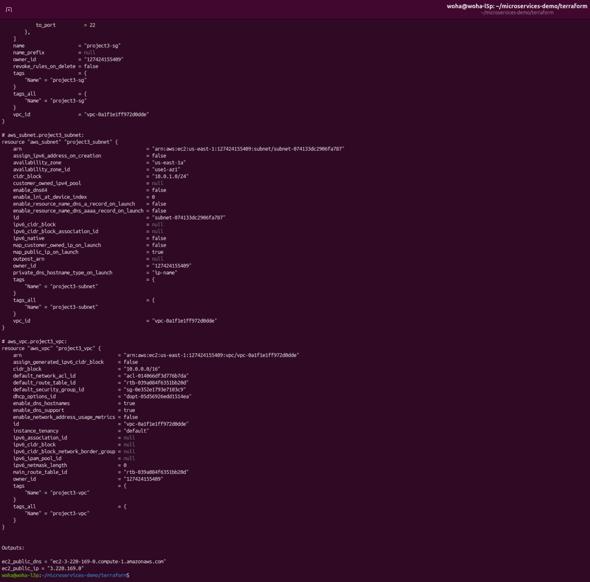

### Step 4 — Configuring the EC2 Instance with Ansible

Ansible was installed on the local machine. An inventory file (`ansible/inventory.ini`) was created pointing to the EC2 instance at `3.220.169.0`, and a playbook (`ansible/setup.yml`) was written to perform the following tasks on the EC2 instance over SSH:

- Update all system packages
- Install Docker CE and add the `ubuntu` user to the `docker` group
- Install microk8s via snap (channel `1.28/stable`)
- Add the `ubuntu` user to the `microk8s` group
- Wait for microk8s to reach a ready state
- Enable the `dns`, `storage`, and `ingress` add-ons
- Export the kubeconfig to `~/.kube/config` so that `kubectl` commands work
- Install Helm (required for ArgoCD)

The playbook was run with:
```bash
ansible-playbook -i ansible/inventory.ini ansible/setup.yml
```

**Ansible playbook not available as setup is already complete at time of writing, current status of microk8s shown instead**

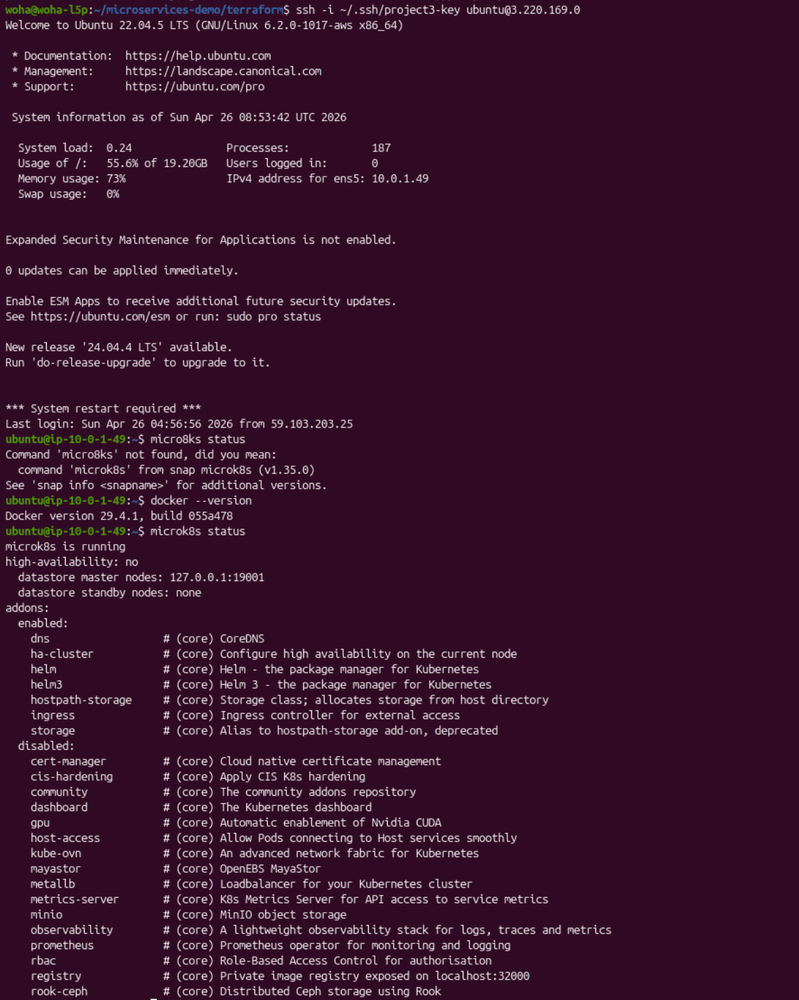

### Step 5 — Writing Kubernetes Manifests

A `Deployment` and a `Service` YAML manifest was written for each of the five microservices in the `k8s/` directory.

- The `frontend` service is exposed as a `NodePort` on port `30080`, making it accessible from the internet at `http://3.220.169.0:30080`
- All other services use `ClusterIP`, meaning they are only reachable from within the cluster by their service name (e.g., `productcatalogservice:3550`)
- The frontend deployment includes environment variables pointing to each backend service by its Kubernetes DNS name

Several issues were encountered and resolved during this step:

- The frontend crashed on startup (`CrashLoopBackOff`) because it calls `mustMapEnv()` for every service address at boot — including services not deployed in this subset. All required environment variables (`CURRENCY_SERVICE_ADDR`, `CHECKOUT_SERVICE_ADDR`, `AD_SERVICE_ADDR`, `SHIPPING_SERVICE_ADDR`, `SHOPPING_ASSISTANT_SERVICE_ADDR`) were added with placeholder addresses so the app could start without crashing.
- The `cartservice` was found to be listening on port `8080` at runtime rather than the `7070` declared in the manifest. The deployment was corrected to set `containerPort: 8080` while keeping the service port at `7070` (with `targetPort: 8080`), so the frontend's address configuration did not need to change.
- The `currencyservice` Docker image was not available from Google Container Registry. The service source was cloned locally and a custom Dockerfile was written, with the image built and pushed to Docker Hub as `i220878/currencyservice:latest`.

### Step 6 — Building and Pushing Docker Images

Docker was installed on the local machine. All five images were built using `docker build` with the repository root as the build context, and pushed to Docker Hub:

```
i220878/frontend
i220878/productcatalogservice
i220878/cartservice
i220878/recommendationservice
i220878/currencyservice
```

**Image of Docker Hub showing all 5 repositories**

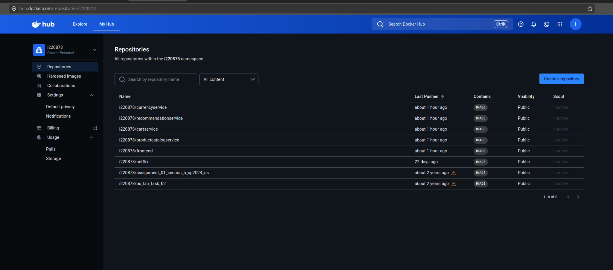

### Step 7 — Installing and Configuring ArgoCD

ArgoCD was installed on the EC2 instance inside the microk8s cluster:

```bash
microk8s kubectl create namespace argocd
microk8s kubectl apply -n argocd -f \
  https://raw.githubusercontent.com/argoproj/argo-cd/stable/manifests/install.yaml
```

The ArgoCD server service was patched to use `NodePort` for external access. The ArgoCD CLI was installed on the EC2 instance using `curl` (with `sudo` to write to `/usr/local/bin/`). The initial admin password was retrieved from the Kubernetes secret and used to log in via the CLI.

ArgoCD is accessible at: `https://3.220.169.0:31175`
Credentials: username `admin`, password `C1MN5SJKxPOYqB80`

**Image of ArgoCD Login Page at https://3.220.169.0:31175**

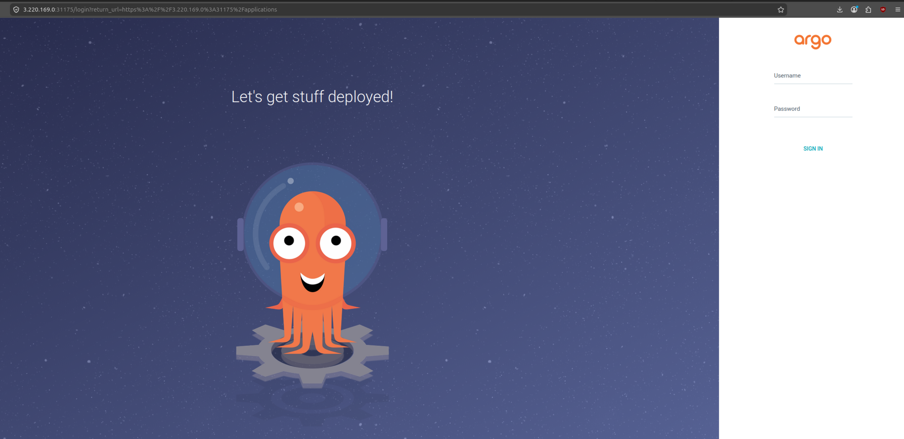

### Step 8 — Configuring ArgoCD to Watch the Repository

An ArgoCD `Application` manifest (`argocd-app.yaml`) was written and applied to the cluster. It configures ArgoCD to:

- Watch the repository at `https://github.com/i220878/microservices-demo.git`
- Track the `k8s/` directory for manifest changes
- Deploy to the `default` namespace of the local cluster
- Automatically sync and self-heal whenever the repository changes

```bash
microk8s kubectl apply -f ~/argocd-app.yaml
```

**Image of ArgoCD Dashboard showing `microservices-demo` app as "Synced" and "Healthy"**

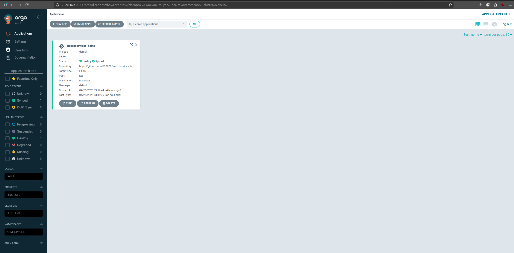

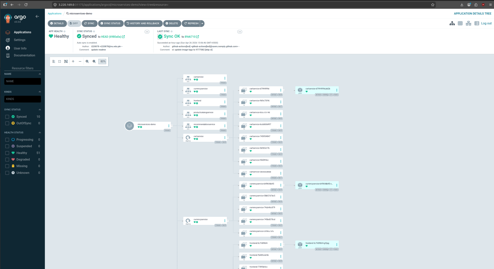

### Step 9 — Setting Up the GitHub Actions CI Pipeline

A workflow file was created at `.github/workflows/ci.yml`. It triggers on every push to `main` that modifies files in `src/` or `docker/`. The pipeline:

1. Checks out the repository
2. Generates a short Git SHA as the image tag
3. Logs into Docker Hub using repository secrets (`DOCKERHUB_USERNAME`, `DOCKERHUB_TOKEN`)
4. Builds and pushes all five Docker images with both the SHA tag and `latest`
5. Updates the image tag in each of the five Kubernetes deployment manifests using `sed`
6. Commits the updated manifests back to the repository and force-pushes to `main`

Several issues were encountered and resolved during this step:

- The initial Personal Access Token lacked the `workflow` scope, preventing the workflow file from being pushed. The token was regenerated with the correct scope.
- The GitHub Actions bot was being denied write access to the repository. This was resolved by enabling **Read and write permissions** under repo Settings → Actions → General → Workflow permissions, and switching the push command to use the built-in `${{ secrets.GITHUB_TOKEN }}` with an explicit token URL.
- Force pushing was required (`--force`) because the CI bot's local git state was always behind the remote after each run. `--force-with-lease` caused failures due to stale ref tracking in the Actions runner.
- The `[skip ci]` tag was added to the bot's commit message to prevent the workflow from triggering itself when it pushes the manifest updates.

After resolving these issues, the full pipeline runs successfully on every code push.

**Image of Github Actions showing a successful workflow run with green status**

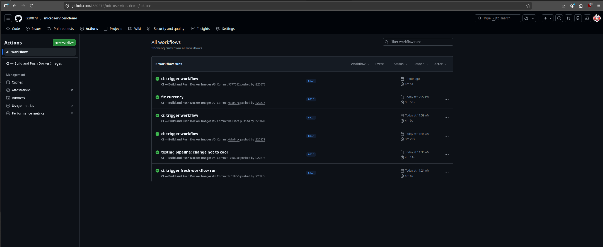

---

## 5. Final Outcome & Verification

The application is fully deployed and accessible. The complete CI/CD loop is operational: a code change pushed to GitHub automatically propagates through the pipeline and appears live on the running application within approximately 5–10 minutes.

### Live URLs

| Resource | URL |
|---|---|
| **Online Boutique (Frontend)** | `http://3.220.169.0:30080` |
| **ArgoCD Dashboard** | `https://3.220.169.0:31175` |
| **GitHub Repository** | `https://github.com/i220878/microservices-demo` |
| **GitHub Actions Workflows** | `https://github.com/i220878/microservices-demo/actions` |
| **Docker Hub Images** | `https://hub.docker.com/u/i220878` |

**Image of the Online Boutique Frontend running at http://3.220.169.0:30080**

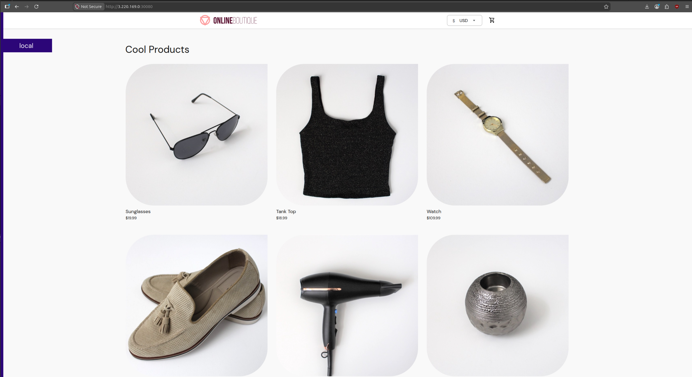

### Verification Commands

All of the following are run on the **EC2 instance** after SSH-ing in with:
```bash
ssh -i ~/.ssh/project3-key ubuntu@3.220.169.0
```

**Check all pods are running:**
```bash
microk8s kubectl get pods -n default
```
Expected output: all 5 pods showing `Running` and `1/1` READY.

**Image of `kubectl get pods` output showing all 5 pods running**

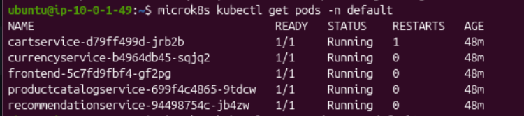

**Check all services are created:**
```bash
microk8s kubectl get services -n default
```
Expected output: all 5 services listed, with `frontend` showing `NodePort` and port `30080`.

**Image of `kubectl get services` output**


**Check ArgoCD application sync status:**
```bash
argocd app get microservices-demo
```
Expected output: `Sync Status: Synced`, `Health Status: Healthy`.

**Image of `argocd app get microservices-demo` output**

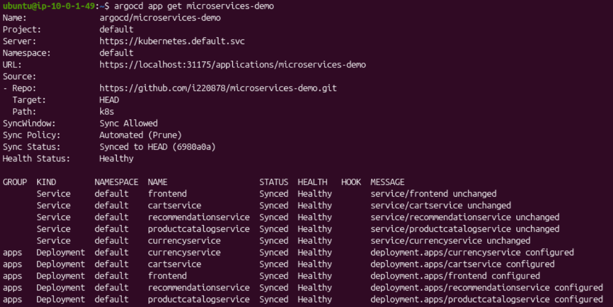

**Check microk8s cluster node status:**
```bash
microk8s kubectl get nodes
```
Expected output: one node with status `Ready`.

**Image of `kubectl get nodes` output**

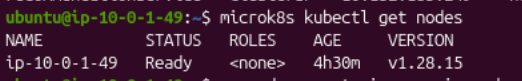


**Watch a live deployment rollout (trigger after a code push):**
```bash
microk8s kubectl get pods -w
```
This streams pod status in real time. After a CI pipeline run completes, old pods will show `Terminating` and new ones will appear with `ContainerCreating` then `Running`, demonstrating the automated CD loop.

### CI/CD End-to-End Flow Summary

```
Developer pushes code change to GitHub
        │
        ▼
GitHub Actions CI workflow triggers
  ├── Builds 5 Docker images
  ├── Pushes images to Docker Hub with new SHA tag
  └── Updates k8s/ manifests with new tag → commits to repo
        │
        ▼
ArgoCD detects manifest change in GitHub repo
  └── Syncs cluster → rolling update of affected pods
        │
        ▼
New version live at http://3.220.169.0:30080
```
